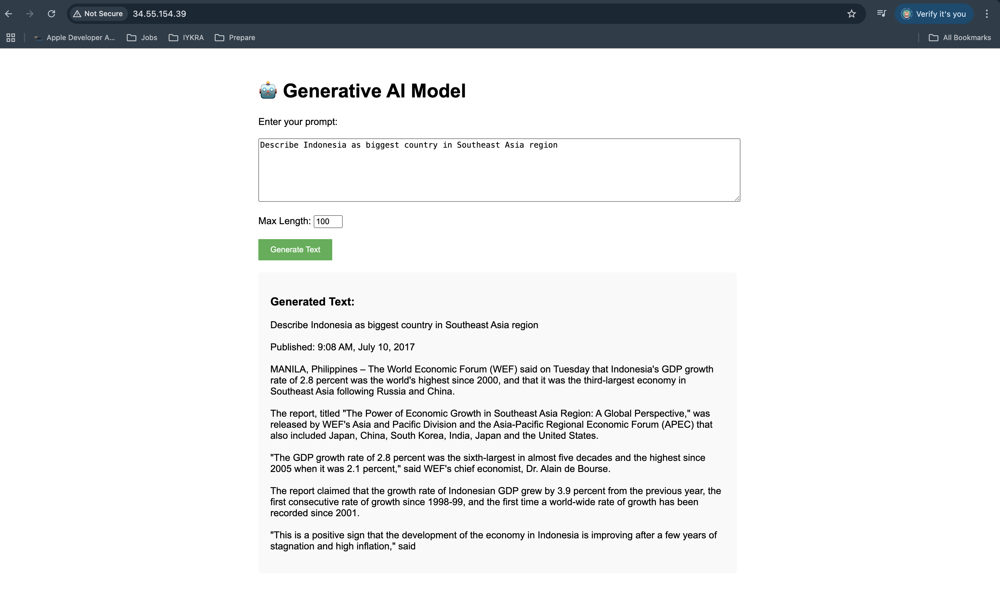

# Generative AI CI/CD Deployment on GCP

## Overview
This project demonstrates automated deployment of a Generative AI model using CI/CD pipeline with Cloud Build and Google Kubernetes Engine.

## Architecture
- **Application**: Flask web app with GPT-2 model
- **Container**: Docker containerized application
- **Orchestration**: Kubernetes with LoadBalancer service
- **CI/CD**: Cloud Build automated pipeline
- **Monitoring**: Built-in health checks and HPA

## Deployment URL
- **Web Interface**: http://34.55.154.39
- **Health Check**: http://34.55.154.39/health
- **API Endpoint**: http://34.55.154.39/generate

!

```bash
## Setting V-env
python3.11 -m venv genai-env
source genai-env/bin/activate
pip install -r requirements.txt 
```

## Budget Alert
Budget alert configured for $50 with notifications at 50%, 90%, and 100% thresholds with only set up budgeting RP 200K.

## Repository Structure
📦GenAI-InitialModel-IYKRA
 ┣ 📂kubernetes
 ┃ ┣ 📜deployment.yaml
 ┃ ┣ 📜hpa.yaml
 ┃ ┗ 📜service.yaml
 ┣ 📂manifests
 ┣ 📂src
 ┃ ┣ 📜app.py
 ┃ ┗ 📜model.py
 ┣ 📜.dockerignore
 ┣ 📜.gitignore
 ┣ 📜Dockerfile
 ┣ 📜Example_result.png
 ┣ 📜README.md
 ┣ 📜cloudbuild.yaml
 ┗ 📜requirements.txt

## Setup Instructions
1. Clone repository
2. Setup GCP project and enable APIs
3. Create GKE cluster
4. Configure Cloud Build trigger
5. Deploy application
6. Access via external IP

## Monitoring
- Kubernetes health checks
- Horizontal Pod Autoscaler
- GCP monitoring and logging
